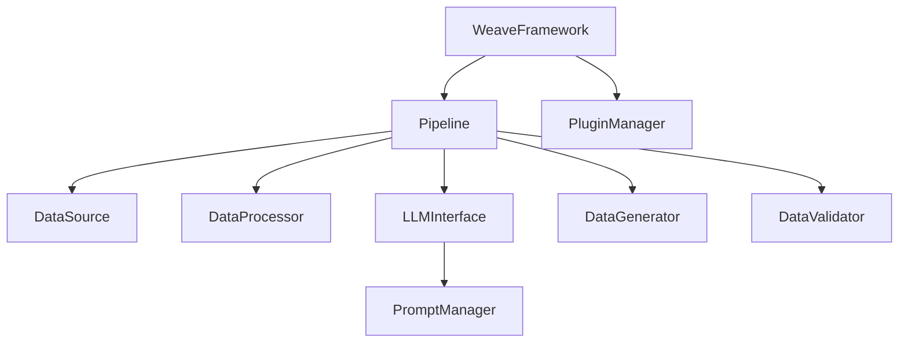

# weave


Weave is a flexible framework for generating high-quality synthetic data using Language Models (LLMs). It provides a modular and extensible architecture that allows users to easily create, customize, and validate synthetic datasets for various applications.

**Note: This project is in its very early stages and is being actively developed in public. Expect frequent changes and improvements.**

GitHub Repository: [https://github.com/ashikshafi08/weave.git](https://github.com/ashikshafi08/weave.git)

## Installation

You can install weave directly from GitHub using pip:
```bash
pip install git+https://github.com/ashikshafi08/weave.git
```

For development, you can clone the repository and install it in editable mode:

```bash
git clone https://github.com/ashikshafi08/weave.git
cd weave
pip install -e .
```


## 🌟 Key Features

- 🔌 **Modular Architecture**: Easily extend and customize components
- 🤖 **Multiple LLM Support**: Use OpenAI, Hugging Face, or custom LLM providers
- 📝 **Flexible Prompt Management**: Customize and version prompts for different use cases
- ✨ **Data Validation**: Ensure quality and correctness of generated data
- 🔄 **Pipeline-based Processing**: Chain operations for complex data generation
- 🔧 **Plugin System**: Add custom functionality through plugins

## 🏗️ Architecture

The Weave framework consists of several core components that work together to generate synthetic data:

### Core Components

1. **WeaveFramework** (`framework.py`)
   - Central orchestrator for the entire process
   - Manages configuration and component lifecycle
   - Coordinates data generation pipeline

2. **Pipeline** (`pipeline.py`)
   - Defines data generation workflow
   - Manages sequence of operations
   - Handles data flow between components

3. **DataSource** (`data_source.py`)
   - Provides initial data or templates
   - Supports multiple data sources (files, databases, APIs)
   - Handles data loading and sampling

4. **DataProcessor** (`data_processor.py`)
   - Transforms and prepares data
   - Implements data cleaning and normalization
   - Supports custom processing logic

5. **LLMInterface** (`llm_interface.py`)
   - Manages LLM interactions
   - Handles prompt submission and response processing
   - Implements rate limiting and error handling

6. **PromptManager** (`prompt_manager.py`)
   - Manages prompt templates
   - Supports dynamic prompt generation
   - Handles template versioning

7. **DataGenerator** (`data_generator.py`)
   - Converts LLM outputs to structured data
   - Implements parsing and formatting logic
   - Ensures data structure consistency

8. **DataValidator** (`data_validator.py`)
   - Validates generated data
   - Implements quality checks
   - Enforces domain-specific rules

9. **PluginManager** (`plugin_manager.py`)
   - Manages framework extensions
   - Handles plugin lifecycle
   - Provides plugin discovery and loading

### Component Interactions



## 🚀 Quick Start

```python
import asyncio
from weave import WeaveFramework

# Configure the framework
config = {
    'pipeline': {
        'type': 'default',
        'stages': ['source', 'process', 'generate', 'validate']
    },
    'data_source': {
        'type': 'json',
        'path': 'templates.json'
    },
    'llm_interface': {
        'type': 'openai',
        'model': 'gpt-4',
        'api_key': 'your-api-key'
    }
}

# Initialize and run
async def generate_data():
    framework = WeaveFramework(config)
    dataset = await framework.generate_dataset(num_samples=10)
    return dataset

if __name__ == "__main__":
    asyncio.run(generate_data())
```

## 📚 Advanced Usage

### Custom Data Source

```python
from weave.core.data_source import DataSource
from weave.core.decorators import register_module

@register_module('data_sources', 'custom')
class CustomDataSource(DataSource):
    async def fetch(self, num_samples: int) -> List[Dict[str, Any]]:
        # Implement custom data fetching logic
        pass

    async def load_data(self, source: str) -> None:
        # Implement custom data loading logic
        pass
```

### Custom Processor

```python
from weave.core.data_processor import DataProcessor
from weave.core.decorators import register_module

@register_module('data_processors', 'custom')
class CustomProcessor(DataProcessor):
    async def process(self, data: List[Dict[str, Any]]) -> List[Dict[str, Any]]:
        # Implement custom processing logic
        pass
```

## 🔧 Configuration

Weave uses YAML configuration files to define component settings and pipeline stages:

```yaml
# config.yaml
pipeline:
  type: default
  stages:
    - source
    - process
    - generate
    - validate

data_source:
  type: json
  path: templates.json
  cache: true

llm_interface:
  type: openai
  model: gpt-4
  api_key: ${OPENAI_API_KEY}
  rate_limit: 60

validator:
  type: default
  rules:
    - schema_validation
    - quality_check
```

## 🧩 Plugin System

Weave supports plugins for extending functionality:

```python
from weave.core.plugin_manager import PluginManager

# Register a plugin
plugin_manager = PluginManager()
plugin_manager.register_plugin('custom_processor', CustomProcessor)

# Use in framework
framework = WeaveFramework(config, plugin_manager=plugin_manager)
```

## 📊 Example: Math Olympiad Problem Generator

Here's a complete example of generating math olympiad problems:

```python
from weave import WeaveFramework
from weave.data_sources import MathOlympiadSource
from weave.data_processors import MathProcessor
from weave.prompt_templates import MathPromptTemplate

config = {
    'pipeline': {
        'type': 'math_olympiad',
        'stages': ['source', 'process', 'generate', 'validate']
    },
    'data_source': {
        'type': 'math_olympiad',
        'difficulty_range': [3, 5],
        'topics': ['algebra', 'geometry', 'number_theory']
    }
}

async def generate_math_problems():
    framework = WeaveFramework(config)
    problems = await framework.generate_dataset(num_samples=10)
    return problems
```

## 🛠️ Development

### Installation

```bash
pip install weave-framework
```

### Running Tests

```bash
pytest tests/
```

### Contributing

1. Fork the repository
2. Create a feature branch
3. Commit your changes
4. Push to the branch
5. Create a Pull Request

## 📝 License

This project is licensed under the MIT License - see the [LICENSE](LICENSE) file for details.

## 🤝 Support

- 📄 [Documentation](docs/)
- 💬 [Discord Community](https://discord.gg/weave)
- 📧 [Email Support](mailto:support@weaveframework.com)


## Contributing

As this project is in its early stages, contributions, suggestions, and feedback are highly welcome! Please feel free to submit issues, feature requests, or pull requests.

## License

This project is licensed under the MIT License - see the [LICENSE](LICENSE) file for details.

## Disclaimer

This project is under active development. APIs may change, and features may be added or removed. It's a learning project and is not intended for production use as of now.
```

